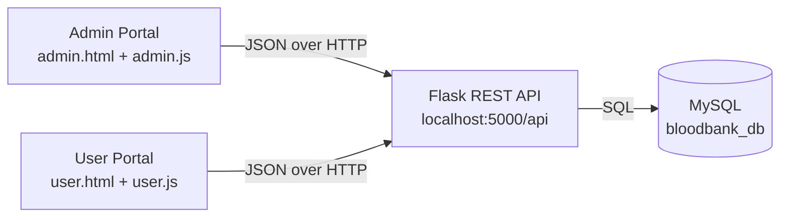

# HemaCore — Blood Bank Management System

HemaCore is a web application for running a blood bank. Blood bank staff use the **Admin Portal** to manage donors, blood stock, blood requests and donation offers, and to produce reports. Members of the public use the **User Portal** to request blood for a patient, offer to donate, and follow the status of both.

The project has a **Flask (Python) REST API** backed by a **MySQL** database, and a front end written in plain **HTML, CSS and JavaScript**.

---

## Contents

- [Features](#features)
- [Tech stack](#tech-stack)
- [How it works](#how-it-works)
- [Project structure](#project-structure)
- [Getting started](#getting-started)
- [Upgrading an existing database](#upgrading-an-existing-database)
- [Roles and permissions](#roles-and-permissions)
- [Business rules](#business-rules)
- [Database](#database)
- [API reference](#api-reference)
- [Configuration](#configuration)
- [Troubleshooting](#troubleshooting)
- [Security notes](#security-notes)

---

## Features

### Admin Portal (`admin.html`)

| Area | What an admin can do |
|---|---|
| **Dashboard** | See total donors, units in stock, pending and fulfilled requests; a stock-by-blood-type chart; a *Needs Attention* panel listing low or empty stock and items waiting for review; requests broken down by status; the latest requests |
| **Donors** | Register, view, edit and delete donors; search by name, phone, email or city; filter by blood type and by whether the donor can donate now |
| **Inventory** | See units for all 8 blood types with healthy / low / out-of-stock levels; add or deduct units; filter by level and sort by quantity |
| **Requests** | Approve, fulfil, reject, edit (while pending) or delete blood requests; search by patient, hospital or requester; filter by blood type, status and date range; view full details including a stock check |
| **Donation offers** | Approve, complete, reject, edit or delete offers; see the donor's name and contact details; filter by blood type, status and preferred date |
| **Reports** | Choose a period (last 7 / 30 days, this month, all time or custom dates) and see summary figures plus nine report tables; export any table as CSV; print or save the page as PDF |
| **Notifications** | Bell with an unread count for new requests, new donation offers and low-stock alerts |

### User Portal (`user.html`)

| Area | What a user can do |
|---|---|
| **Account** | Create an account (this also creates their donor record), sign in and out |
| **Home** | See their own requests and offers at a glance, current blood availability (their own blood type highlighted), their next eligible donation date and recent activity |
| **My Requests** | Submit a blood request for a patient; search and filter their requests; edit or cancel them while pending |
| **Donate Blood** | Check donation eligibility (age, weight, days since last donation); offer to donate on a chosen date and time slot; edit or cancel pending offers |
| **My Profile** | Update name, phone, blood type, date of birth and address; change password |
| **Notifications** | Bell with an unread count; told when a request or offer is approved, fulfilled, completed or rejected |

### Both portals

- Light and dark themes, switchable at any time (the choice is remembered).
- Work on phones and tablets as well as desktops.
- Each portal keeps its own login, so an admin and a user can be signed in side by side in the same browser.

---

## Tech stack

| Layer | Technology |
|---|---|
| Front end | HTML5, CSS3, vanilla JavaScript (no framework or build step) |
| Back end | Python 3, Flask, Flask-JWT-Extended (login tokens), Flask-CORS |
| Database | MySQL 8, accessed with `mysql-connector-python` |
| Passwords | Hashed with `bcrypt` |
| Configuration | `.env` file loaded with `python-dotenv` |

---

## How it works



1. The browser loads the pages from a simple static file server (port 8000).
2. Every action on a page calls the API (port 5000) through the shared `apiFetch()` helper in `frontend/api.js`.
3. On sign-in, the API checks the password and returns a **JWT login token**. The page sends that token with every later request (`Authorization: Bearer <token>`), so the API knows who is asking and what they are allowed to do.
4. The API applies the business rules (stock checks, ownership, admin-only actions), reads and writes MySQL, and returns JSON.

The browser never talks to the database directly — all rules are enforced on the server, where they cannot be bypassed.

---

## Project structure

```
hema_core_blood/
├── README.md
├── backend/                     Flask REST API
│   ├── run.py                   Starts the API and registers all modules
│   ├── db.py                    MySQL connection and the list of blood types
│   ├── auth.py                  Sign-up, login, profile, password; admin-only check
│   ├── donors.py                Donor register
│   ├── inventory.py             Blood stock
│   ├── requests.py              Blood requests
│   ├── donations.py             Donation offers
│   ├── reports.py               Admin reports
│   ├── notifications.py         Notifications and low-stock alerts
│   ├── schema.sql               Creates the database and all tables
│   ├── create_admin.py          Creates the first admin account
│   ├── fix_duplicate_donors.py  One-time upgrade script (see below)
│   ├── migrate_user_role.py     One-time upgrade script (see below)
│   ├── requirements.txt         Python packages
│   └── .env.example             Template for the settings file
└── frontend/                    Web pages
    ├── admin.html / admin.js    Admin Portal
    ├── user.html / user.js      User Portal
    └── api.js                   Shared helpers: API calls, login token, theme, notifications
```

---

## Getting started

### Prerequisites

- **Python 3.10 or newer**
- **MySQL 8** (MySQL Server running locally; MySQL Workbench is optional but handy)
- **Git**

### 1. Get the code

```
git clone https://github.com/govindhere06-code/HemaCore.git
cd HemaCore
```

### 2. Install the Python packages

```
python -m venv venv
venv\Scripts\python -m pip install -r backend/requirements.txt
```

On macOS / Linux use `venv/bin/python` instead of `venv\Scripts\python` throughout.

### 3. Create the settings file

Copy `backend/.env.example` to `backend/.env` and fill it in:

| Setting | Meaning | Example |
|---|---|---|
| `DB_HOST` | MySQL server address | `127.0.0.1` |
| `DB_PORT` | MySQL port | `3306` |
| `DB_USER` | MySQL user | `root` |
| `DB_PASSWORD` | That user's MySQL password | *(your password)* |
| `DB_NAME` | Database name | `bloodbank_db` |
| `JWT_SECRET_KEY` | Secret used to sign login tokens — use a long random string | *(random string)* |
| `JWT_ACCESS_TOKEN_EXPIRES` | How long a login lasts, in seconds | `3600` (1 hour) |

`backend/.env` holds your password and is excluded from Git by `.gitignore` — never commit it.

### 4. Create the database

```
mysql -u root -p < backend/schema.sql
```

That works in Command Prompt, macOS and Linux. PowerShell doesn't support `<`, so there use:

```
Get-Content backend/schema.sql | mysql -u root -p
```

(Or open `schema.sql` in MySQL Workbench and run it with the ⚡ button.) This creates the `bloodbank_db` database with all six tables and a stock row for each of the 8 blood types (starting at 0 units). It is safe to run again: existing tables are left alone.

### 5. Create the admin account

```
venv\Scripts\python backend/create_admin.py
```

This creates the admin login **`admin@hemacore.com`** with the password **`admin123`**. Change this password before using the system for anything real (see [Security notes](#security-notes)).

User accounts are created by signing up in the User Portal.

### 6. Run the application

Start the API (terminal 1):

```
venv\Scripts\python backend/run.py
```

Serve the web pages (terminal 2):

```
venv\Scripts\python -m http.server 8000 --directory frontend
```

Then open:

- **Admin Portal:** http://localhost:8000/admin.html
- **User Portal:** http://localhost:8000/user.html

---

## Upgrading an existing database

Two changes were made to the database after the first version. A database created from the current `schema.sql` already has them. If your database was created earlier, run these once (both are safe to run more than once):

```
venv\Scripts\python backend/fix_duplicate_donors.py
venv\Scripts\python backend/migrate_user_role.py
```

| Script | What it does |
|---|---|
| `fix_duplicate_donors.py` | Merges donor records that share an email into one (keeping the oldest record, filling in blank details and the latest donation date), then makes donor emails unique |
| `migrate_user_role.py` | Converts accounts with the old `staff` role to the new `user` role and limits roles to `admin` and `user` |

If you are upgrading from a version without notifications, also run `schema.sql` again to add the `notifications` table.

---

## Roles and permissions

There are two roles. The server always assigns **`user`** at sign-up; admin accounts can only be created with `create_admin.py`.

| Action | User | Admin |
|---|:---:|:---:|
| Submit blood requests and donation offers | ✅ | ✅ |
| View, edit and cancel **own** pending requests and offers | ✅ | ✅ |
| View other people's requests and offers | — | ✅ |
| Approve, fulfil, complete or reject requests and offers | — | ✅ |
| Edit requests / offers that are no longer pending | — | ✅ (see rules) |
| View, add, edit and delete donors | — | ✅ |
| View stock levels | ✅ | ✅ |
| Add or deduct stock | — | ✅ |
| Reports | — | ✅ |
| Own profile, password and notifications | ✅ | ✅ |

Each portal also checks the role at sign-in: the Admin Portal refuses user accounts and the User Portal refuses admin accounts.

---

## Business rules

| Rule | Details |
|---|---|
| **Stock check on approval** | A request can only be approved if enough units of that blood type are in stock; otherwise it is refused and stays pending. |
| **Stock deducted once** | Units are deducted when a request is approved (or fulfilled directly). Rejecting or deleting an approved request returns the units to stock. |
| **Donations counted once** | When a donation offer is first approved (or completed), its units are added to stock and the donor's last donation date is set to the scheduled date. Approving again does not add them twice. |
| **One donor record per person** | Donors are matched by email (unique, case-insensitive). Approving an offer updates the person's existing donor record, or creates one if they have none. |
| **Editing** | Requests can be edited only while **pending**, because stock is deducted on approval. Approved donation offers can only have their date, time and notes changed. |
| **Donation eligibility** | A donor is eligible again **56 days** after their last donation. The eligibility checker also asks for age 18–65 and weight of at least 50 kg. |
| **Low stock** | A blood type with **10 units or fewer** is shown as *low*; **0** is *out of stock*. |
| **Low-stock alerts** | Admins are notified when a blood type's stock falls from above 10 to 10 or below, or runs out. The alert is sent when the line is crossed, not on every deduction. |
| **Notifications** | Pages check for new notifications every 30 seconds, and the admin page checks immediately after changing stock or a request's status. |
| **Passwords** | At least 6 characters, stored as bcrypt hashes. |

---

## Database

All tables live in the `bloodbank_db` database and are created by `backend/schema.sql`.

| Table | Holds | Key columns |
|---|---|---|
| `users` | Login accounts | `email` (unique), `password_hash`, `role` (`admin` / `user`), `phone` |
| `donors` | Donor register | `blood_type`, `phone`, `email` (unique), `date_of_birth`, `address`, `last_donation_date` |
| `blood_inventory` | Stock for each blood type | `blood_type` (unique), `units_available` |
| `blood_requests` | Blood requests | `patient_name`, `hospital`, `blood_type`, `units`, `status` (`pending` / `approved` / `fulfilled` / `rejected`), `created_by` → `users.id` |
| `donation_offers` | Offers to donate | `user_id` → `users.id`, `blood_type`, `units`, `preferred_date`, `preferred_time`, `notes`, `status` (`pending` / `approved` / `completed` / `rejected`) |
| `notifications` | Bell notifications | `user_id` → `users.id`, `title`, `message`, `type` (`info` / `success` / `warning` / `danger`), `link`, `is_read` |

Donor records are linked to user accounts by **email**. Deleting a user also deletes their donation offers and notifications; their blood requests are kept with the requester cleared.

To browse the data, connect MySQL Workbench to `127.0.0.1:3306` as `root`, then expand **Schemas → bloodbank_db → Tables** and choose *Select Rows* on a table.

---

## API reference

Base URL: `http://localhost:5000/api`

All requests and responses use JSON. Except for sign-up and login, every call needs the login token:

```
Authorization: Bearer <access_token>
```

**Access** column: *Public* — no login; *Logged in* — any account; *Admin* — admin accounts only (others get `403`).

### Authentication — `/api/auth`

| Method | Path | Access | Description |
|---|---|---|---|
| `POST` | `/auth/register` | Public | Create a user account (and their donor record if a blood type and phone are given) |
| `POST` | `/auth/login` | Public | Sign in; returns `access_token` and `role` |
| `GET` | `/auth/me` | Logged in | Current account, including their donor record |
| `PUT` | `/auth/me` | Logged in | Update name, phone, blood type, date of birth, address |
| `POST` | `/auth/change-password` | Logged in | Change password (current password required) |

### Donors — `/api/donors`

| Method | Path | Access | Description |
|---|---|---|---|
| `GET` | `/donors/` | Admin | List donors (optional `?blood_type=`) |
| `GET` | `/donors/<id>` | Admin | One donor |
| `POST` | `/donors/` | Admin | Add a donor |
| `PUT` | `/donors/<id>` | Admin | Edit a donor |
| `DELETE` | `/donors/<id>` | Admin | Delete a donor |

### Inventory — `/api/inventory`

| Method | Path | Access | Description |
|---|---|---|---|
| `GET` | `/inventory/` | Logged in | Units for all blood types |
| `GET` | `/inventory/<blood_type>` | Logged in | Units for one blood type |
| `POST` | `/inventory/add` | Admin | Add units: `{"blood_type": "A+", "units": 5}` |
| `POST` | `/inventory/deduct` | Admin | Deduct units (refused if not enough stock) |

### Blood requests — `/api/requests`

| Method | Path | Access | Description |
|---|---|---|---|
| `GET` | `/requests/` | Logged in | Admins get all requests, users get their own (optional `?status=`) |
| `GET` | `/requests/<id>` | Logged in | One request (users: own only, otherwise `404`) |
| `POST` | `/requests/` | Logged in | Submit a request: patient name, hospital, blood type, units |
| `PUT` | `/requests/<id>` | Logged in | Edit a pending request (users: own only) |
| `PATCH` | `/requests/<id>/status` | Admin | Set status: `approved`, `fulfilled` or `rejected` (updates stock) |
| `DELETE` | `/requests/<id>` | Logged in | Delete (users: own pending only; admins: any, returning stock if approved) |

### Donation offers — `/api/donations`

| Method | Path | Access | Description |
|---|---|---|---|
| `GET` | `/donations/` | Logged in | Admins get all offers (optional `?user_id=`), users get their own (optional `?status=`) |
| `GET` | `/donations/<id>` | Logged in | One offer (users: own only, otherwise `404`) |
| `POST` | `/donations/` | Logged in | Offer to donate: blood type, units, preferred date and time, notes |
| `PUT` | `/donations/<id>` | Logged in | Edit an offer (users: own pending only) |
| `PATCH` | `/donations/<id>/status` | Admin | Set status: `approved`, `completed` or `rejected` (updates stock and donor record) |
| `DELETE` | `/donations/<id>` | Logged in | Delete (users: own pending only) |

### Reports — `/api/reports`

| Method | Path | Access | Description |
|---|---|---|---|
| `GET` | `/reports/?from=YYYY-MM-DD&to=YYYY-MM-DD` | Admin | Summary figures and report tables for the period (both dates optional) |

### Notifications — `/api/notifications`

| Method | Path | Access | Description |
|---|---|---|---|
| `GET` | `/notifications/` | Logged in | Latest 30 notifications and the unread count |
| `PATCH` | `/notifications/<id>/read` | Logged in | Mark one of your notifications as read |
| `POST` | `/notifications/read-all` | Logged in | Mark all your notifications as read |

### Example

In Windows Command Prompt (in PowerShell, type `curl.exe` instead of `curl`):

```
curl -X POST http://localhost:5000/api/auth/login ^
     -H "Content-Type: application/json" ^
     -d "{\"email\": \"admin@hemacore.com\", \"password\": \"admin123\"}"

curl http://localhost:5000/api/inventory/ -H "Authorization: Bearer <access_token>"
```

(On macOS / Linux replace `^` with `\` and use single quotes around the JSON.)

### Status codes

| Code | Meaning |
|---|---|
| `200` / `201` | Success / created |
| `400` | Missing or invalid input |
| `401` | Not logged in, wrong password, or the account no longer exists |
| `403` | Logged in but not allowed (for example, a user calling an admin action) |
| `404` | Not found (also returned for another user's request or offer) |
| `409` | Conflict — not enough stock, item no longer editable, or email already registered |

---

## Configuration

| What | Where | Default |
|---|---|---|
| Database connection and login settings | `backend/.env` | — |
| API port | `backend/run.py` | `5000` |
| Web page port | the `http.server` command | `8000` |
| API address used by the pages | `API` constant at the top of `frontend/api.js` | `http://localhost:5000/api` |
| Low-stock threshold | `LOW_STOCK` in `backend/notifications.py`, `backend/reports.py`, `frontend/admin.js`, `frontend/user.js` | `10` |
| Days between donations | `DONATION_GAP_DAYS` in `backend/reports.py`, `frontend/admin.js`, `frontend/user.js` | `56` |

If you change the API port or run the API on another machine, update the `API` constant in `frontend/api.js` to match.

---

## Troubleshooting

| Problem | Likely cause and fix |
|---|---|
| `Access denied for user 'root'@'localhost'` when starting the API | Wrong `DB_PASSWORD` in `backend/.env` — it must be the password that works for `mysql -u root -p`. |
| `Can't connect to MySQL server` | The MySQL service isn't running. Start **MySQL80** from Windows *Services*, or from MySQL Workbench under *Administration → Startup / Shutdown*. |
| `Unknown database 'bloodbank_db'` | Step 4 hasn't been run — create the database from `backend/schema.sql`. |
| Pages load but every action fails / "Failed to fetch" | The API isn't running, or isn't on port 5000. Start `backend/run.py` and check the `API` address in `frontend/api.js`. |
| Page looks out of date after an update | The browser is using a cached copy — press **Ctrl + F5**. |
| Logged out unexpectedly | Login tokens expire after `JWT_ACCESS_TOKEN_EXPIRES` seconds (1 hour by default); sign in again. |
| "Admin accounts should sign in through the Admin Portal" | You used the admin login on the User Portal — use `admin.html` instead (and vice versa). |
| Sign-up fails with a role or column error on an old database | Run the upgrade scripts in [Upgrading an existing database](#upgrading-an-existing-database). |

---

## Security notes

HemaCore is a prototype intended for learning and demonstration. Before using it with real data:

- **Change the admin password.** `create_admin.py` uses a fixed password (`admin123`) that is published in this repository.
- **Use a long random `JWT_SECRET_KEY`** and keep `backend/.env` private.
- **Don't expose the development servers.** `run.py` starts Flask in debug mode and `http.server` is a basic file server; for deployment use a production WSGI server (such as Gunicorn or Waitress) behind HTTPS.
- **Restrict cross-origin access.** The API currently accepts requests from any website (`CORS(app)`); limit this to the site that serves the pages.
- **Use a dedicated MySQL user** with access to `bloodbank_db` only, instead of `root`.
